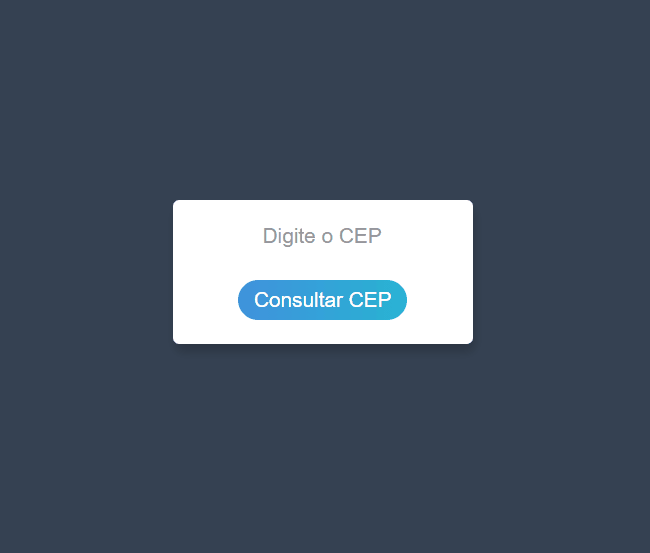

<h1>Pesquisa CEP</h1>

<h1 align="center">
    
</h1>

<h2>Sobre o Projeto</h2>

Esta aplicação fornece o endereço de um CEP que deseja buscar. 
Para isso necessita somente inserir o CEP e clicar no botão "enter", logo abaixo o endereço será informado.
Caso o CEP for incorreto, será informado uma mensagem de erro.
 

<h2>Tecnologias</h2>

As seguintes ferramentas foram usada na construção do projeto.

<ul>
    <li>HTML</li>
    <li>CSS</li>
    <li>Javascript</li>
</ul>

<h2>Pré Requisitos para execução do Projeto</h2>

Para iniciar será necessário instalar:

<ul>
    <li>VSCode;</li>
    <li>No VSCode, a extensão "Live Server";</li>
</ul>

Ao abrir no VSCode o projeto e clicar para abrir a página do Live Server, ficará vísivel um campo de preenchimento, no qual poderá inserir o CEP desejado.

Veja meu linkedin: <a href="https://www.linkedin.com/in/souzasamuelp/">Samuel Souza</a>

Veja meu Github: <a href="https://github.com/souzasamuelp">Samuel Souza</a>
